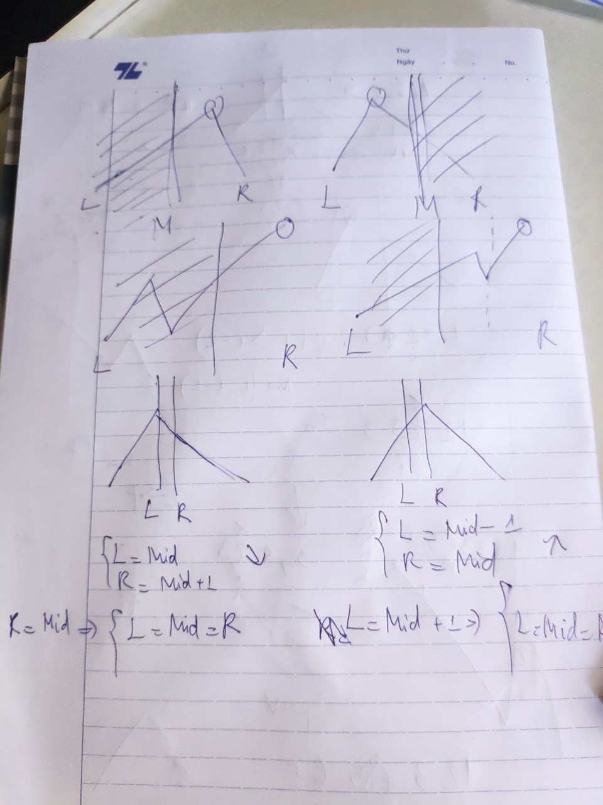

162. Find Peak Element
Medium

A peak element is an element that is strictly greater than its neighbors.

Given an integer array nums, find a peak element, and return its index. If the array contains multiple peaks, return the index to any of the peaks.

You may imagine that nums[-1] = nums[n] = -∞.

Example 1:

Input: nums = [1,2,3,1]
Output: 2
Explanation: 3 is a peak element and your function should return the index number 2.
Example 2:

Input: nums = [1,2,1,3,5,6,4]
Output: 5
Explanation: Your function can return either index number 1 where the peak element is 2, or index number 5 where the peak element is 6.
 

Constraints:

1 <= nums.length <= 1000
-231 <= nums[i] <= 231 - 1
nums[i] != nums[i + 1] for all valid i.
 

Follow up: Could you implement a solution with logarithmic complexity?

Hints:

* Find when a peak happen? Draw lines to demonstrate it

* It happens when something going up then suddenly go down :D

* Cut array in half (yes, like binary search), if middle is going up then cut the left side, if middle is going down then cut the right side

