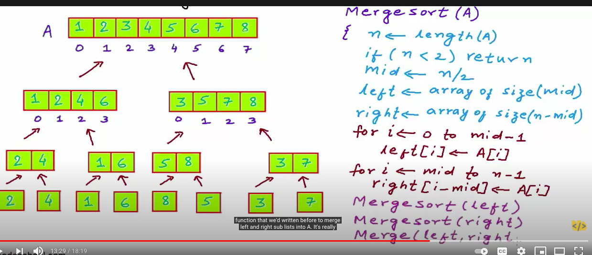
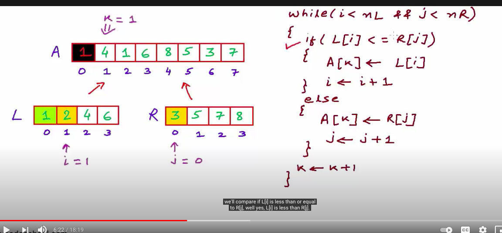
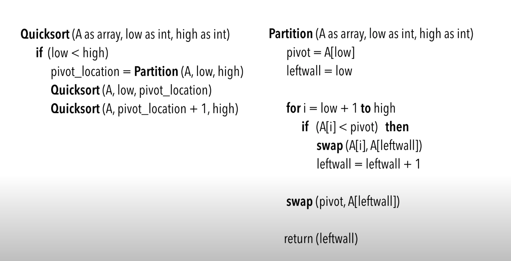
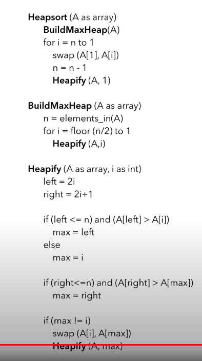

# SORTING ALGORITHMS

Giả sử sort từ nhỏ đến lớn

## Selecting sort

**Select** cái nhỏ nhất rùi swap

https://www.youtube.com/watch?v=g-PGLbMth_g

3 6 4 8 5 2 -> **2** 3 6 4 8 5

## Bubble sort

https://www.youtube.com/watch?v=xli_FI7CuzA

so 2 cái gần nhất rùi swap để **Buble** cái lớn nhất lên

3 6 4 8 5 2 -> 3 4 6 5 2 **6**

## Insertion sort

https://www.youtube.com/watch?v=JU767SDMDvA

bên trái đã sort, bên phải chưa, chọn cái đầu bên phải rùi **insert** nó vào đúng chỗ bên trái

3 6 4 8 5 2 -> **3 6** 4 8 5 2 -> **3 4 6** 8 5 2

## Merge sort

https://www.youtube.com/watch?v=4VqmGXwpLqc

https://www.youtube.com/watch?v=TzeBrDU-JaY

chia 2 chia 2 đến khi còn 1 tk rùi ngồi merge lại

## Quick sort

chọn 1 pivot trong mảng, đi 1 vòng mảng và swap sao cho bên trái gồm các số nhỏ hơn pivot, bên phải gồm các số lớn hơn, đệ quy tiếp tục...

cách partition:

https://www.youtube.com/watch?v=MZaf_9IZCrc

#### 1 trong cách chọn pivot:

chọn số đầu giữa cuối, rùi chọn số có giá trị ở giữa

## Heap sort

có 2 functions:

** build-bin-tree: từ mảng xây một cái cây nhị phân (không cần thứ tự sort gì cả)

** heaplify: từ tree thành max heap (parent node luôn có giá trị lớn hơn 2 children node)

array => tree = build-bin-tree(array) => heap-max = heaplify(tree)

=> head là số cao nhất, đưa nó lên trong mảng, remove nó khỏi cây => heaplify => ....

